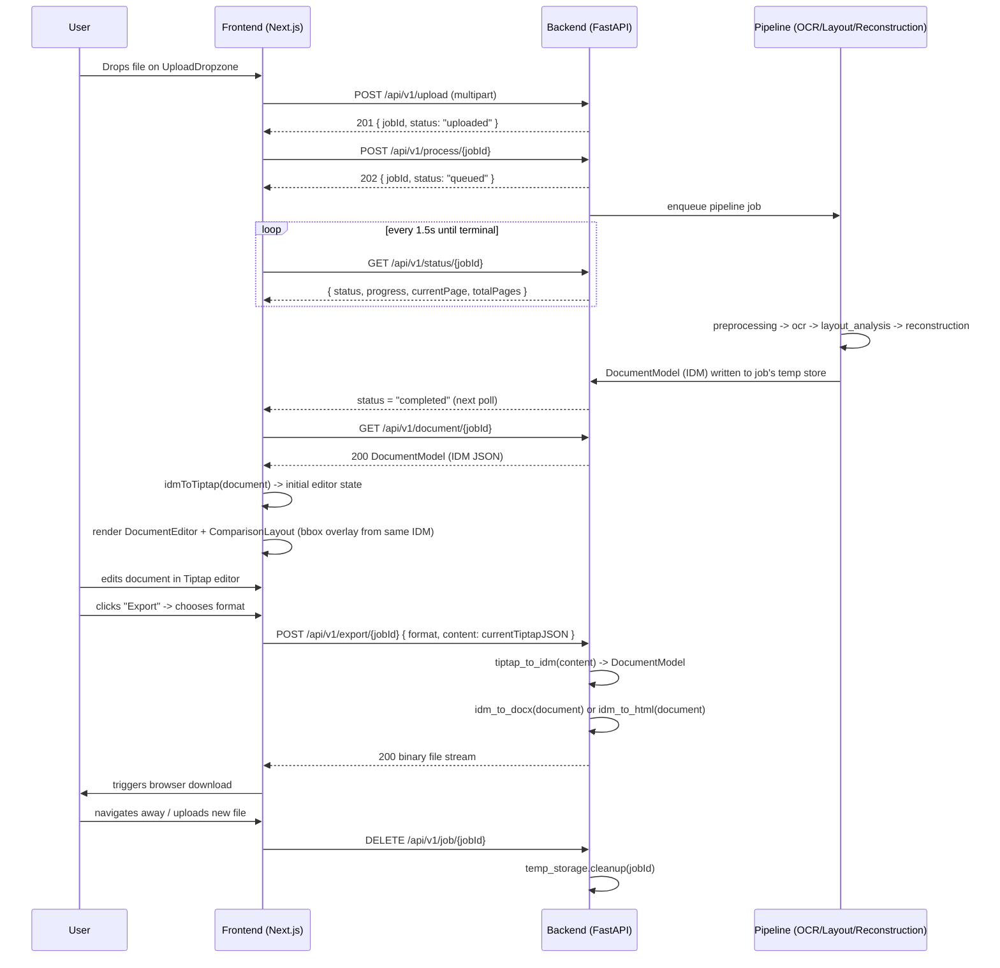

# DATA_FLOW.md

## Purpose

Walks the entire request lifecycle end to end, naming the exact payload/schema in play at every
hop. This document is the connective tissue between `API_SPECIFICATION.md`,
`DOCUMENT_RECONSTRUCTION.md`, `EDITOR_SPECIFICATION.md`, and `EXPORT_SYSTEM.md` — read those for
the full schema of anything referenced here by name only.

## End-to-End Sequence



## Job Status State Machine

Owned by `backend/app/core/job_manager.py`. This is the authoritative set of states and legal
transitions — the frontend's `useJobStore` mirrors this exactly and must not invent intermediate
UI-only states.

```
uploaded → queued → preprocessing → ocr → layout_analysis → reconstruction → completed
                 \        \             \            \                \
                  -------- any of these can transition to -----------> failed
```

- `uploaded`: set by `POST /upload`. File is on disk, pipeline not yet triggered.
- `queued`: set by `POST /process`. Job is in the processing queue.
- `preprocessing` → `ocr` → `layout_analysis` → `reconstruction`: set by the pipeline itself as it
  advances; each stage updates `progress` (0-100, computed as stage-weighted: preprocessing 0-10,
  ocr 10-60, layout_analysis 60-80, reconstruction 80-100) and `currentPage`/`totalPages` for
  multi-page documents.
- `completed`: IDM has been written and is retrievable via `GET /document`.
- `failed`: terminal. `error` field on the status response is populated per `ERROR_HANDLING.md`.
  No further transitions; the frontend surfaces `ErrorState.tsx` and offers re-upload, not retry
  of the same jobId (temp inputs may be partially consumed).

There is no `cancelled` state in v1 — the project scope has no concept of a long-running job the
user actively cancels mid-flight (documents are expected to process in low tens of seconds; see
`PERFORMANCE.md` for the target envelope). This is a deliberate v1 scope cut, not an oversight.

## Payload Identity Through the Pipeline

The same `Block.id` values assigned during `reconstruction/idm_builder.py` are the ones that:

1. Appear in the IDM returned by `GET /document`.
2. Become `attrs.sourceBlockId` on Tiptap nodes via `idmToTiptap.ts`.
3. Are read by `HighlightBridge.tsx` when the user clicks a block in either comparison pane.
4. Are read back out by `tiptap_to_idm.py` at export time (for blocks the user didn't touch) or
   replaced with freshly generated ids (for blocks the user created — see
   `EDITOR_SPECIFICATION.md` "Reverse Mapping" rules).

No new id scheme is introduced at any layer — this single id space is what makes Comparison Mode
and round-trip export both possible without a separate mapping table.

## Comparison Mode Click-to-Highlight Flow

1. `OriginalDocumentPane.tsx` renders the same preprocessed page image the IDM's `bbox` values are
   relative to (not the raw upload — see `DOCUMENT_RECONSTRUCTION.md`, Page Object). It draws an
   invisible clickable overlay `<div>` per block using each block's `bbox`.
2. Clicking an overlay region sets `useComparisonStore.activeSourceBlockId = block.id`.
3. `DocumentEditor.tsx` subscribes to `activeSourceBlockId`; on change, it queries the ProseMirror
   doc for the node whose `attrs.sourceBlockId` matches, scrolls it into view, and applies a
   temporary highlight decoration.
4. The reverse direction (click text in the editor → highlight original) reads
   `attrs.sourceBlockId` off the clicked node directly (no lookup needed — it's on the node) and
   sets the same store field, which `OriginalDocumentPane.tsx` also subscribes to for its own
   highlight overlay.
5. Blocks with `sourceBlockId === null` (user-created content with no source counterpart) are
   simply not clickable in the editor→original direction — `HighlightBridge.tsx` treats this as a
   no-op, not an error state.

## Temp Storage Lifecycle

Per-job directory: `{TEMP_ROOT}/{jobId}/` containing the original upload, intermediate
preprocessed page images, and (once complete) the serialized IDM JSON. Nothing is written to a
database — `job_manager.py` holds job metadata (status, progress, timestamps) in an in-memory
dict, acceptable given the project's explicit "no database" scope constraint. A background sweep
(interval configurable, default every 10 minutes) deletes any job directory older than 30 minutes
regardless of status, and `DELETE /job/{jobId}` deletes immediately on explicit request. Full
detail in `SECURITY.md` and `FILE_PROCESSING.md`.
